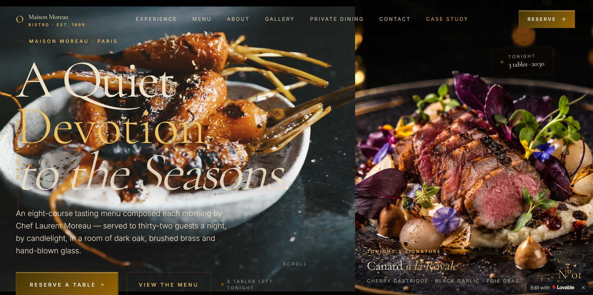

# 🍷 Maison Moreau UX/UI Case Study

Premium hospitality website concept focused on luxury branding, user experience, accessibility, and mobile-first design.

## 📸 Screenshot

---

## 🚀 Live Demo

https://premiumuxui.lovable.app

---

## 🎯 Project Goal

The goal of this project was to design a premium digital experience for a fictional luxury restaurant brand.

The project focuses on:

* User-centered design
* Premium visual storytelling
* Mobile-first experience
* Accessibility considerations
* Clear reservation journey
* Luxury hospitality branding

---

## 🛠 Tools Used

* HTML
* CSS
* JavaScript
* Responsive Design Principles
* UX/UI Design
* Mobile-First Design
* Accessibility Best Practices
* Lovable

---

## ✨ Key Features

* Elegant premium design
* Responsive layout
* Interactive user experience
* Luxury restaurant storytelling
* Optimized reservation flow
* Mobile-friendly interface

---

## 📚 What I Learned

* UX research and planning
* Information architecture
* User journey optimization
* Responsive web design
* Visual hierarchy
* Brand-focused interface design

---

## Future Improvements

- Online reservation functionality
- Interactive menu experience
- Customer reviews section
- Multi-language support
- Performance optimization

---

## 👨‍💻 About the Creator

Created by Sahba Maraghehmiyanji, an Application Support Specialist and Master's student in Germany with interests in UX/UI design, web development, and digital product experiences.

LinkedIn:
https://www.linkedin.com/in/sahba-maragheh-miyanji/

GitHub:
https://github.com/Sahba-mnj
